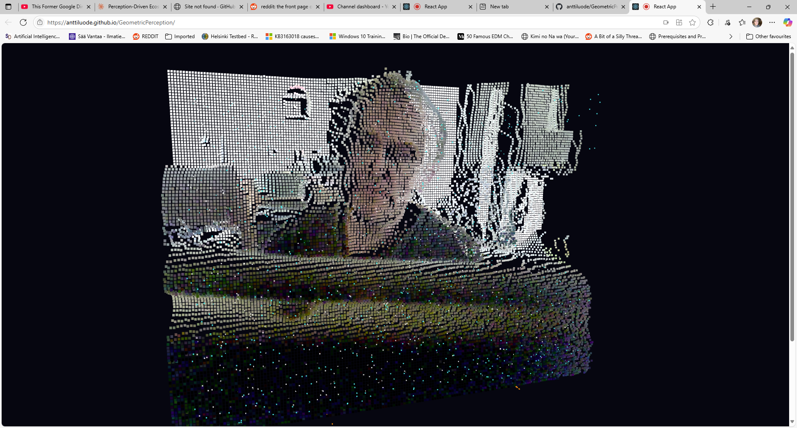

# 🧠 Geometric Perception Engine

Live at: https://anttiluode.github.io/GeometricPerception/

A 3D interactive visualization that transforms your webcam feed into a living, breathing point cloud inhabited by thousands of intelligent "scouts" that respond to your movements.

## ✨ What Is This?

This is an experimental AI perception system that:
- Converts your webcam into a 3D point cloud in real-time
- Deploys thousands of colored "scouts" that analyze different aspects of your visual input
- Creates beautiful, organic patterns as scouts respond to edges, motion, brightness, and colors
- Lets you explore the 3D space by rotating and zooming around your own digitized presence

## 🎮 How to Use

1. **Allow camera access** when prompted
2. **Scroll down** to see the main 3D visualization (it appears below the initial interface)
3. **Move in front of the camera** to see scouts swarm toward your movements
4. **Drag to rotate** the 3D space around your webcam feed
5. **Scroll to zoom** in and out
6. **Toggle scout types** to see different perception modes

## 🔍 Scout Types

- **🟠 Edge Scouts**: Detect and follow sharp boundaries and contrasts
- **🔵 Motion Scouts**: React to movement and changes in the scene  
- **⚪ Luminance Scouts**: Respond to brightness and lighting changes
- **🔴 Color R/G/B Scouts**: Track specific color channels

## 🌟 The Magic

Watch as thousands of scouts create swirling, organic patterns that respond to your every gesture. Each scout type perceives the world differently, creating a multi-layered visualization of how computational vision might "see" and understand your presence.

## 🚀 Live Demo

**[Try it here!](https://anttiluode.github.io/GeometricPerception)**

*Note: Remember to scroll down to see the main 3D visualization area*

## 🛠️ Tech Stack

- React + Three.js for 3D rendering
- WebRTC for webcam access
- Custom orbit controls for 3D navigation
- Real-time computer vision processing

## 🎯 Pro Tips

- **Wave your hands** for dramatic scout swarms
- **Try different lighting** to see luminance scouts react
- **Wear colorful clothing** to activate color-specific scouts
- **Move closer/farther** to see depth perception in action

---

*An exploration of computational perception and the beauty of seeing through artificial eyes.*
